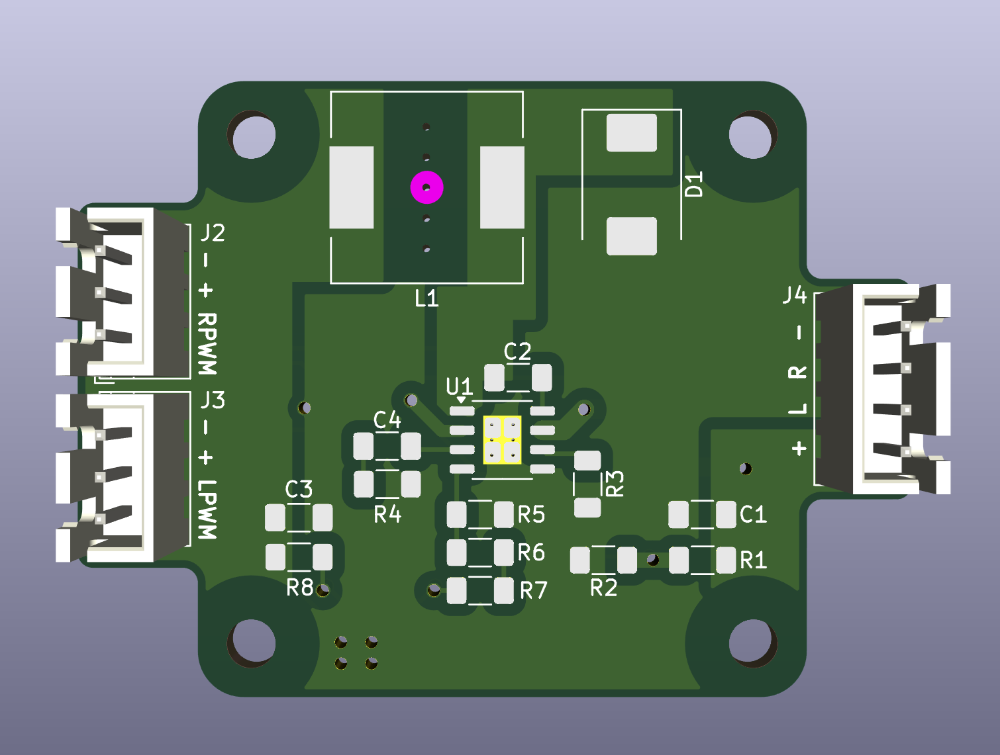
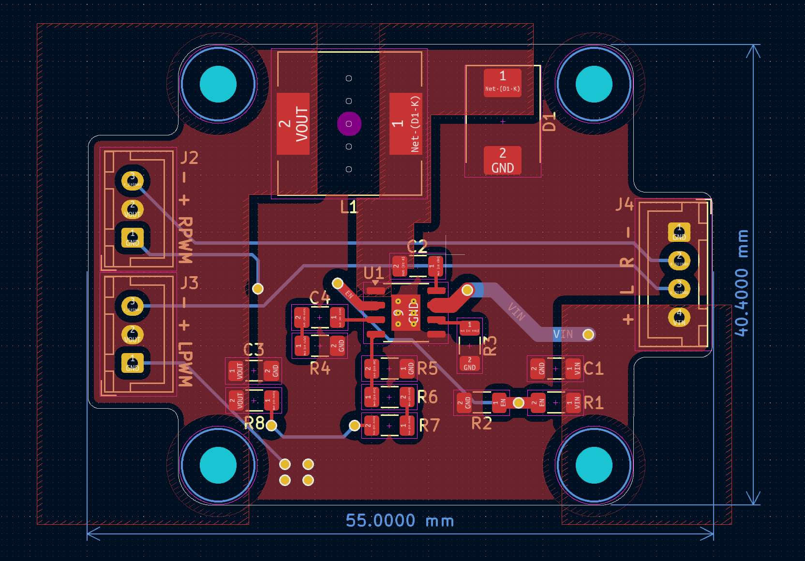
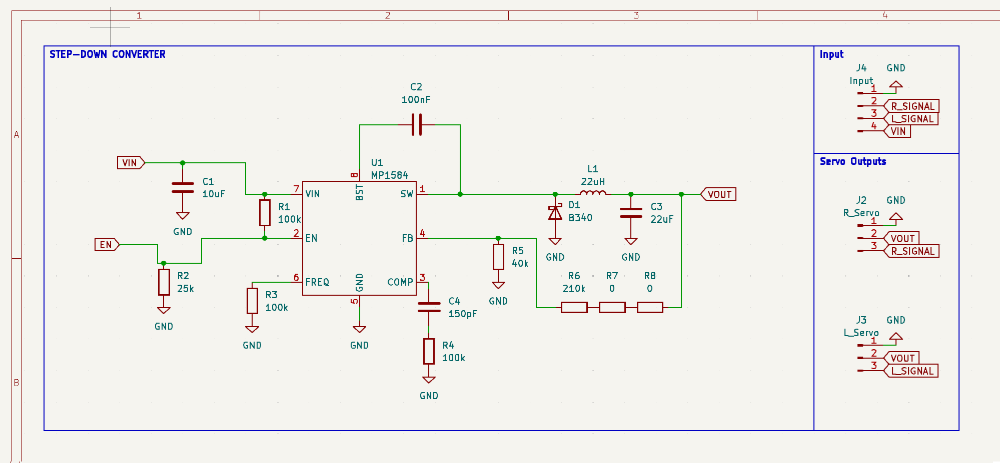

Here is a designed power board for my work in progress drone, its a fixed wing drone based on my custom FC.

It contains **3 resistors (R6, R7, R8)** because my local electronics supplier doesnt have any 210k resistors in stock. Thats also why im using MP1584 as my IC.

**R1 = 50.25 * (Vout - 0.8)** (formula for output voltage calculation, given in datasheet)

I will be using **220k instead of 210k because 5.2V is better for servos over long cables** so they will still run at full performance after the voltage drop.

The PCB is 1 sided, it seems like 2 but i make the PCBs as 1 layer and solder 22AWG wires for the bottom layer, which can easily deliver 3A.

<figure>
  

    

    

    
  

  <figcaption>
    Images of schematic and PCB layout.
  </figcaption>
</figure>