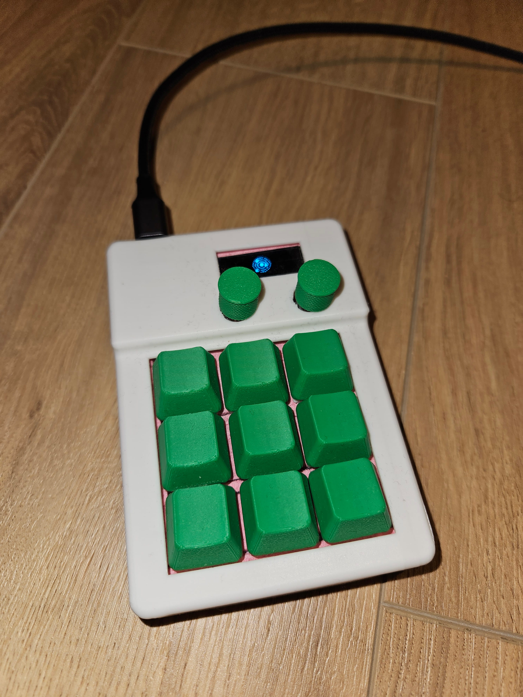

This project is an experimental macropad built to evaluate the **RP2350** microcontroller for a larger, more complex device.
The goal is to explore hardware capability, firmware workflow, early.

- **RP2350 board**
- **128×32 display**
- **9 keyboard switches**
- **2 rotary encoders**

The MLDH-Macropad is capable of saving the config file to its own flash, so we dont need a seperate app to hold the config for us.

## Command-Line Interface

The macropad firmware exposes a simple command-line interface over USB for configuration and testing.  
This makes it possible to adjust key mappings and encoder behavior without reflashing the device.

I have built a non-functional python app for these, but as i said its non-functional, at least i tried.

### Available Commands

- `show`  
  Display the current keymap and encoder assignments.

- `set key <row 0..2> <col 0..2> <macro>`  
  Assign a macro to a key at the specified row and column.

- `set enc <0|1> <cw|ccw> <macro>`  
  Assign a macro to an encoder direction.

- `save`  
  Save the current configuration to non-volatile storage.

- `resetdefaults`  
  Restore the default keymap and encoder configuration.

### Macro Format

Macros can be specified using readable key combinations or raw hexadecimal values.

Supported formats include:

- `ctrl+c`
- `win+shift+s`
- `alt+f4`
- `0xMM:0xKK` — modifier + key
- `0xKK` — key only

<figure>
  

    

    
  

  <figcaption>
    RP2350 macropad prototype — separated components (left) and assembled unit (right).
  </figcaption>
</figure>
